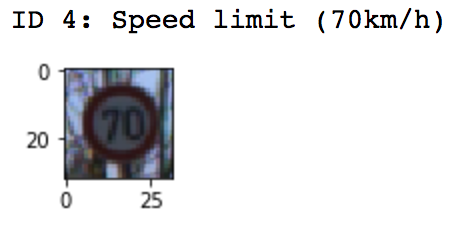
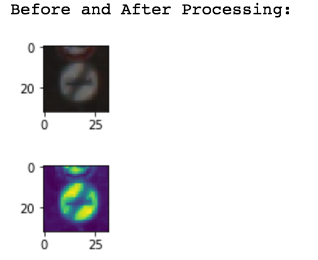
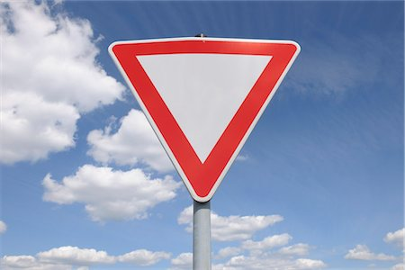
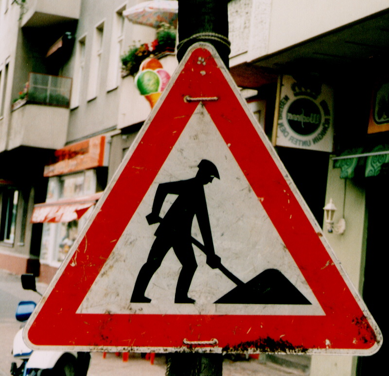

# Writeup: Build a Traffic Sign Recognition Project

The goals / steps of this project are the following:
* Load the data set
* Explore, summarize and visualize the data set
* Design, train and test a model architecture
* Use the model to make predictions on new images
* Analyze the softmax probabilities of the new images
* Summarize the results with a written report

---
## Writeup / README

#### 1. Provide a Writeup / README that includes all the rubric points and how you addressed each one. You can submit your writeup as markdown or pdf. You can use this template as a guide for writing the report. The submission includes the project code.

You're reading it! and here is a link to my [project code](https://github.com/cassiecarr/CarND-TrafficSignClassifier-P2-1/blob/master/Traffic_Sign_Classifier.ipynb)

### Data Set Summary & Exploration

#### 1. Provide a basic summary of the data set and identify where in your code the summary was done. In the code, the analysis should be done using python, numpy and/or pandas methods rather than hardcoding results manually.

The code for this step is contained in the second code cell of the IPython notebook.  

I used the numby library to calculate summary statistics of the traffic signs data set:

* Number of training examples
* Number of validation examples
* Number of testing examples
* Image data shape
* Number of classes

####2. Include an exploratory visualization of the dataset and identify where the code is in your code file.

The code for this step is contained in the third code cell of the IPython notebook.  

Here is an exploratory visualization of the data set, where a random image of the training set is plotted.
It also notes the ID and sign name for the image.

###Design and Test a Model Architecture

####1. Describe how, and identify where in your code, you preprocessed the image data. What tecniques were chosen and why did you choose these techniques? Consider including images showing the output of each preprocessing technique. Pre-processing refers to techniques such as converting to grayscale, normalization, etc.

The code for this step is contained in the fourth code cell of the IPython notebook.

My pre-processing techniques included 4 steps. First, I converted the images to grayscale to simplify the data processing.

Second, the images were normalized using min max normalization within a range of 0 to 1. This helps with images that have poor contrast and brings all input values into a set range. See the effects below:

Third, additional augemented images were added to the training set, representing random translations, rotations, zoom, brightness, and contrast.

Fourth, the images were randomly shuffled. 

####2. Describe how, and identify where in your code, you set up training, validation and testing data. How much data was in each set? Explain what techniques were used to split the data into these sets. (OPTIONAL: As described in the "Stand Out Suggestions" part of the rubric, if you generated additional data for training, describe why you decided to generate additional data, how you generated the data, identify where in your code, and provide example images of the additional data)

As described with my pre-processing techniques above, augmented images were added to the training set in order to provide additional data with more varience to improve accuracy and improve model robustness against rotation, brightness, etc. The training set originally contained 34,799 examples. Augmented images were used to increase this by a factor of six, resulting in over 200,000 training images.

The code for splitting the data into training and validation sets is contained in the second code cell of the IPython notebook.  

The training and testing images provided in the traffic sign dataset were utilized. In the future, it would be an improvement to combine these images, then randomly split the training data into a training set and validation set.

My final training set had 208,794 images. My validation set and test set had 4,410 and 12,630 images, respectively.

####3. Describe, and identify where in your code, what your final model architecture looks like including model type, layers, layer sizes, connectivity, etc.) Consider including a diagram and/or table describing the final model.

The code for my final model is located in the sixth cell of the ipython notebook. 

My final model consisted of the following layers, following the LeNet architecuture:

| Layer         		|     Description	        					| 
|:---------------------:|:---------------------------------------------:| 
| Input         		| 32x32x1 grayscale image   					| 
| Convolution 5x5     	| 1x1 stride, valid padding, outputs 28x28x6 	|
| RELU					|												|
| Max pooling	      	| 2x2 stride,  outputs 14x14x6					|
| Convolution 5x5     	| 1x1 stride, valid padding, outputs 10x10x16 	|
| RELU					|												|
| Max pooling	      	| 2x2 stride,  outputs 5x5x6					|
| Fully connected		| outputs 120       							|
| RELU					|												|
| Fully connected		| outputs 84       								|
| RELU					|												|
| Fully connected		| outputs 43     								|
| Softmax				| outputs softmax values		 				|

To prevent overfitting, dropout was executed after the final activation function. In addition, L2 regularization was applied based on weights of the last three fully connected layers. 

####4. Describe how, and identify where in your code, you trained your model. The discussion can include the type of optimizer, the batch size, number of epochs and any hyperparameters such as learning rate.

The code for training the model is located in cells seven through eleven of the ipython notebook. 

To train the model, I used the atom optimizer function in TensorFlow to minimize the loss function. Various batch sizes were used during training to find the optimal solution, eventually settling on 128 with the best results. In addition, the number of epochs were varied to determine the point where the model was continuing to improve without entering regions of overfitting and flattening results. Hyperparameters were originally set based on the model used in the LeNet lab and were tuned to ensure the most effective values were set for this application (these hyperparameters include learning rate, L2 regularization rate beta, dropout rate, and arguments for defining intial weights and bias).

####5. Describe the approach taken for finding a solution. Include in the discussion the results on the training, validation and test sets and where in the code these were calculated. Your approach may have been an iterative process, in which case, outline the steps you took to get to the final solution and why you chose those steps. Perhaps your solution involved an already well known implementation or architecture. In this case, discuss why you think the architecture is suitable for the current problem.

The code for calculating the accuracy of the model, based on the testing and validation sets, is located in the eleventh cell of the Ipython notebook. The test set accuracy is set in the 12th cell.

My final model results were:
* training set accuracy of 99.8%
* validation set accuracy of 95.7%
* test set accuracy of 93.1%

I came to the results above by starting with the LeNet architecture from the lab. The architecutre proved to work well for the mnist data and was a good base for the german traffic sign data. In order to improve the model, pre-processing was implemented, followed by the addition of dropout and L2 regularization to prevent overfitting, and tuning of hyperparameters. 

If an iterative approach was chosen:
* What was the first architecture that was tried and why was it chosen?
* What were some problems with the initial architecture?
* How was the architecture adjusted and why was it adjusted? Typical adjustments could include choosing a different model architecture, adding or taking away layers (pooling, dropout, convolution, etc), using an activation function or changing the activation function. One common justification for adjusting an architecture would be due to over fitting or under fitting. A high accuracy on the training set but low accuracy on the validation set indicates over fitting; a low accuracy on both sets indicates under fitting.
* Which parameters were tuned? How were they adjusted and why?
* What are some of the important design choices and why were they chosen? For example, why might a convolution layer work well with this problem? How might a dropout layer help with creating a successful model?

If a well known architecture was chosen:
* What architecture was chosen?
* Why did you believe it would be relevant to the traffic sign application?
* How does the final model's accuracy on the training, validation and test set provide evidence that the model is working well?
 
A well known architecture, LeNet, was chosen. This model was believed to be relevant to the traffic sign application because it worked well with a similar dataset (mnist). The base model started with a relatively high validation accuracy (~89%) and improved when data pre-processing, augmentation, dropout, L2 regularization, etc were added. The results achieved with LeNet were not superior, but validation and test accuracy were both above 93%, proving it to be an acceptable choice for this assignment. In the future, experimenting with other models could be worth while.  

###Test a Model on New Images

####1. Choose five German traffic signs found on the web and provide them in the report. For each image, discuss what quality or qualities might be difficult to classify.

Here are five German traffic signs that I found on the web:

    

The stop, road work, and speed limit images could be difficult to classify due to their noisy backgrounds, especially the speed limit image, since the background to sign ratio is large. The yield and right-of-way images look to be relativly straight forward, being the backgrounds are simple and lighting is good.

####2. Discuss the model's predictions on these new traffic signs and compare the results to predicting on the test set. Identify where in your code predictions were made. At a minimum, discuss what the predictions were, the accuracy on these new predictions, and compare the accuracy to the accuracy on the test set (OPTIONAL: Discuss the results in more detail as described in the "Stand Out Suggestions" part of the rubric).

The code for making predictions on my final model is located in the 14th cell of the Ipython notebook.

Here are the results of the prediction:

| Image			        				|     Prediction	        					| 
|:-------------------------------------:|:---------------------------------------------:| 
| Yield         						| Yeild         				 				|
| Stop      							| Stop  										|
| Road Work      						| Road Work   									| 
| Speed limit (30km/h)					| Bicycles Crossing		     					|
| Right-of-way at the next intersection	| Right-of-way at the next intersection     	|

The model was able to correctly guess 4 of the 5 traffic signs, which gives an accuracy of 80%. This compares favorably to the accuracy on the test set of 93.1%. The one image that did not give a successful prediction was the speed limit sign, which is most likely due to the fact there is a large amount of background noise compared to the amount of space in the image taken up by the sign. 

####3. Describe how certain the model is when predicting on each of the five new images by looking at the softmax probabilities for each prediction and identify where in your code softmax probabilities were outputted. Provide the top 5 softmax probabilities for each image along with the sign type of each probability. (OPTIONAL: as described in the "Stand Out Suggestions" part of the rubric, visualizations can also be provided such as bar charts)

The code for making predictions on my final model, including softmax probabilities, is located in the 16th cell of the Ipython notebook. The list below shows the top 5 softmax probabilities for each traffic sign image:

Image  1
	True Value: 13, Yield
	Probability 1(100%): 13, Yield
	Probability 2(0%): 3, Speed limit (60km/h)
	Probability 3(0%): 12, Priority road
	Probability 4(0%): 9, No passing
	Probability 5(0%): 0, Speed limit (20km/h)
 
Image  2
	True Value: 14, Stop
	Probability 1(64%): 14, Stop
	Probability 2(32%): 34, Turn left ahead
	Probability 3(3%): 13, Yield
	Probability 4(0%): 3, Speed limit (60km/h)
	Probability 5(0%): 12, Priority road
 
Image  3
	True Value: 25, Road work
	Probability 1(100%): 25, Road work
	Probability 2(0%): 23, Slippery road
	Probability 3(0%): 24, Road narrows on the right
	Probability 4(0%): 29, Bicycles crossing
	Probability 5(0%): 20, Dangerous curve to the right
 
Image  4
	True Value: 1, Speed limit (30km/h)
	Probability 1(67%): 29, Bicycles crossing
	Probability 2(27%): 23, Slippery road
	Probability 3(2%): 20, Dangerous curve to the right
	Probability 4(2%): 31, Wild animals crossing
	Probability 5(0%): 28, Children crossing
 
Image  5
	True Value: 11, Right-of-way at the next intersection
	Probability 1(99%): 11, Right-of-way at the next intersection
	Probability 2(0%): 30, Beware of ice/snow
	Probability 3(0%): 31, Wild animals crossing
	Probability 4(0%): 21, Double curve
	Probability 5(0%): 23, Slippery road

Three of the five images 99-100% confident with the correct value (yield, road work, and right-of-way). The stop sign, while correct, only had a probability of 64%. And the speed limit sign, which was incorrect, had a probability of 67% for bicycles crossing, the correct sign type was not even listed in the top 5. I believe the background noise of the speed limit sign caused it to be difficult to classify.

